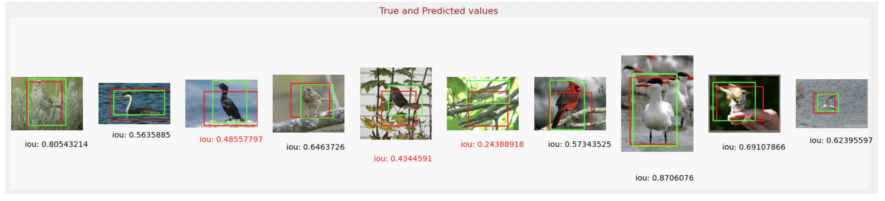

# Image classification and Object Detection (Faster RCNN multiple-object detection)

This work presents three examples of using transfer-learning to do image classification and object detection

### 1. **`Image Classification and object detection.ipynb`** 

- uses [MNIST](http://yann.lecun.com/exdb/mnist/) dataset, which contains image with size `(28, 28, 1)` and classes of 10 (num 0 to 9)
- classify the main subject in an image
- localize it by drawing bounding boxes around it.

example of drawing a box around a image, (original, with_bounding_ox)

  
   

and the final result can be evaluated by the iou parameter.
 
 
 ### 2. **`Predicting_bounding_box_Caltech_Bird.ipynb`** 
 
- uses `caltech_birds2010` dataset in the `tensorflow_datasets`. 
- predict the location of bounding box using the **MobileNet V2** network and fine-tune the model by moving the top layers. 
The result:  

### 3. **`faster_RCNN_multiple_object_detection.ipynb`**
- use the model from the [tensorflow_hub](https://tfhub.dev/), including 
1. * [ssd + mobilenet V2](https://tfhub.dev/tensorflow/ssd_mobilenet_v2/2) small and fast.
2. * [FasterRCNN + InceptionResNet V2](https://tfhub.dev/google/faster_rcnn/openimages_v4/inception_resnet_v2/1): high accuracy
