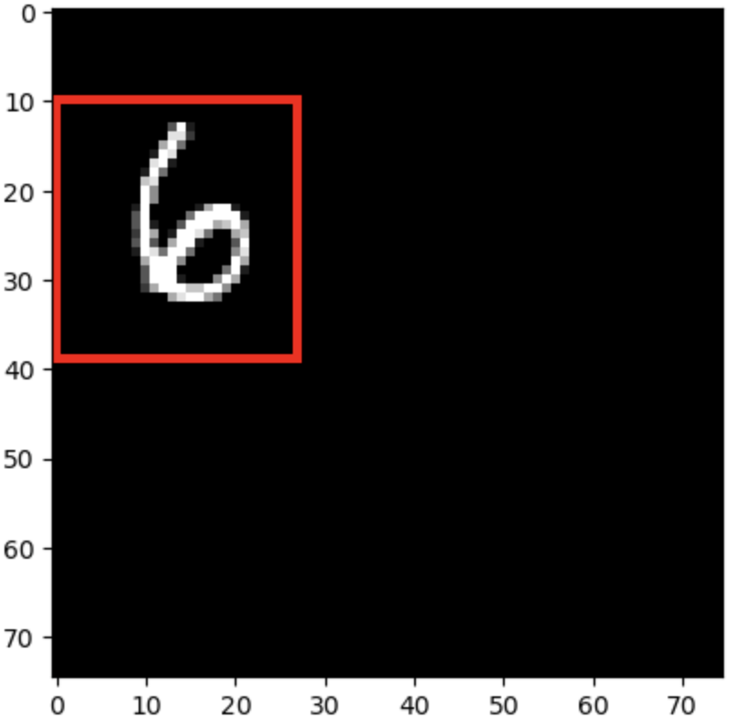
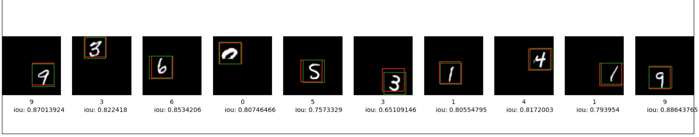

# Image classification and Object Detection

This work presents two examples of using transfer-learning to do image classification and object detection

**`Image Classification and object detection.ipynb`** uses [MNIST](http://yann.lecun.com/exdb/mnist/) dataset, which contains image with size `(28, 28, 1)` and classes of 10 (num 0 to 9)

Work in this Code:
- classify the main subject in an image
- localize it by drawing bounding boxes around it.

example of drawing a box around a image, (original, with_bounding_ox)

  
   

and the final result
 
